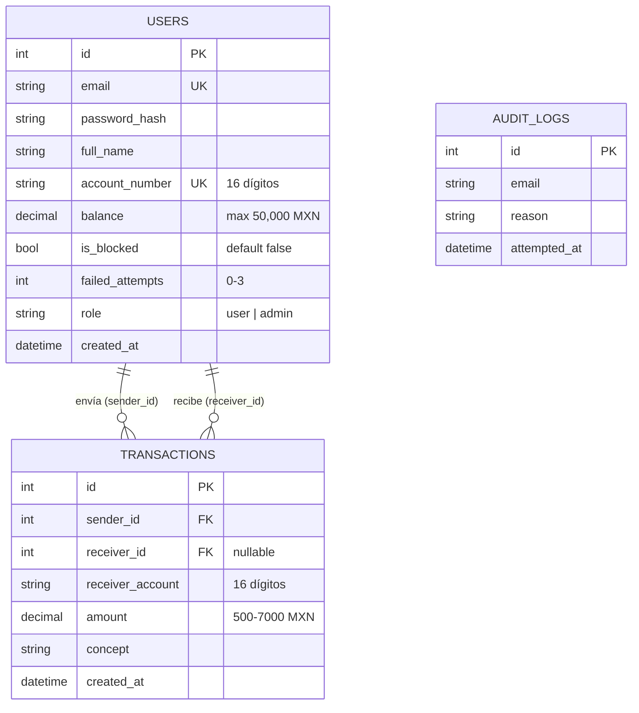

# Diagrama Entidad-Relación — Banco UP

Pega el bloque de abajo en [mermaid.live](https://mermaid.live) o en un bloque de código Mermaid en Confluence.

---

## Descripción de tablas

### `users`
| Campo | Tipo | Restricción | Descripción |
|-------|------|-------------|-------------|
| id | INTEGER | PK AUTO | ID único |
| email | VARCHAR(100) | UNIQUE NOT NULL | Correo (debe tener @) |
| password_hash | VARCHAR(255) | NOT NULL | bcrypt |
| full_name | VARCHAR(100) | NOT NULL | Nombre completo |
| account_number | VARCHAR(16) | UNIQUE NOT NULL | 16 dígitos numéricos auto-generados |
| balance | NUMERIC(10,2) | NOT NULL DEFAULT 0 | Saldo en MXN, máx $50,000 |
| is_blocked | BOOLEAN | DEFAULT false | Bloqueada tras 3 intentos fallidos |
| failed_attempts | INTEGER | DEFAULT 0 | Contador de intentos fallidos |
| role | VARCHAR(10) | DEFAULT 'user' | 'user' o 'admin' |
| created_at | DATETIME | AUTO NOW | Fecha de registro |

### `transactions`
| Campo | Tipo | Restricción | Descripción |
|-------|------|-------------|-------------|
| id | INTEGER | PK AUTO | ID único |
| sender_id | INTEGER | FK users.id | Quien envía |
| receiver_id | INTEGER | FK users.id, NULL | Quien recibe (interno) |
| receiver_account | VARCHAR(16) | NOT NULL | Cuenta destino |
| amount | NUMERIC(10,2) | NOT NULL | Entre $500 y $7,000 MXN |
| concept | VARCHAR(200) | NOT NULL | Descripción del movimiento |
| created_at | DATETIME | AUTO NOW | Fecha/hora de la transferencia |

### `audit_logs`
| Campo | Tipo | Descripción |
|-------|------|-------------|
| id | INTEGER PK | Auto |
| email | VARCHAR(100) | Correo del intento |
| reason | VARCHAR(200) | Descripción del error |
| attempted_at | DATETIME | Timestamp del intento |

---

## Reglas de negocio derivadas del modelo

- `balance` nunca puede ser negativo (RF-10)
- `balance` nunca puede superar $50,000 MXN (RF-08)
- `amount` debe estar entre $500 y $7,000 MXN (RF-07)
- `account_number` siempre tiene exactamente 16 dígitos (RNF-09)
- Después de 3 entradas en `audit_logs` para el mismo email → `is_blocked = true` (RF-03)
